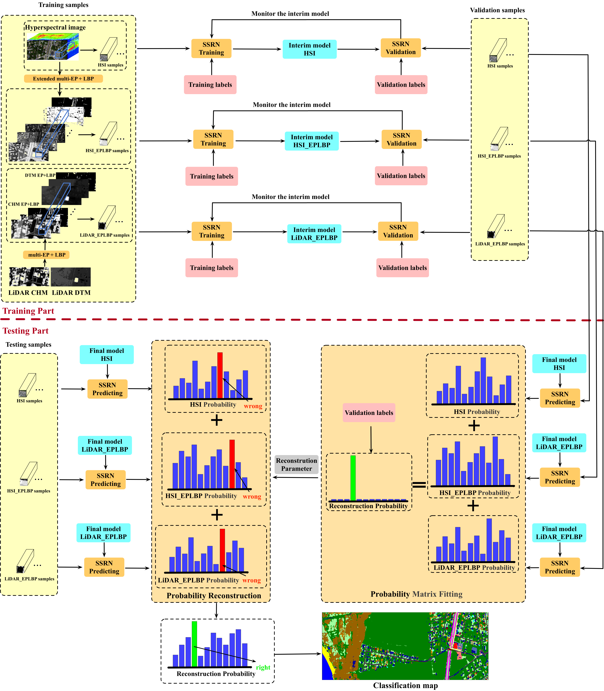
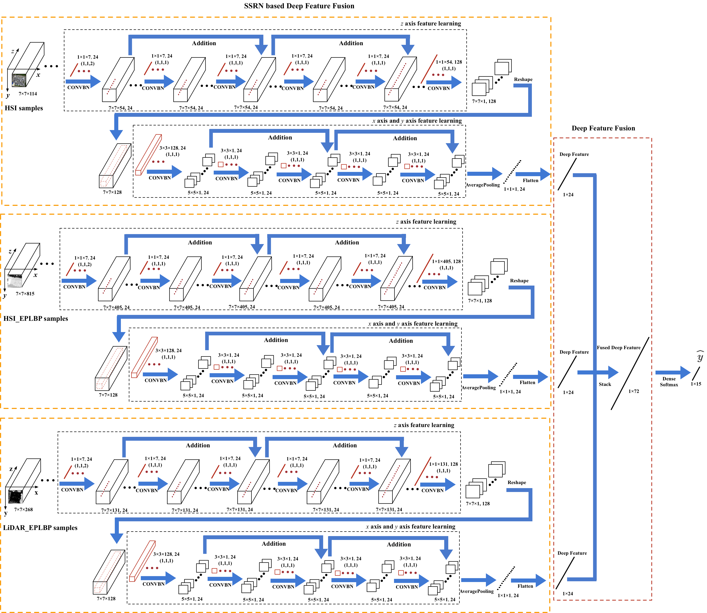
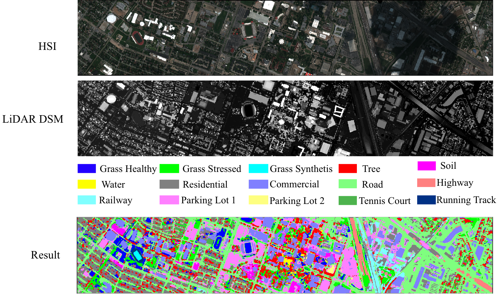

# Implementation of RNPRF, RNDFF and RNPMF for Hyperspectral and LiDAR Fusion Classification

The purpose of the shared code is to promote communication. Our proposed methods can be used as comparison methods for hyperspectral and LiDAR fusion classification.

If you find this code useful for your research, consider citing:

[1] Chiru Ge, Qian Du, Weiwei Sun, Keyan Wang, Jiaojiao Li, and Yunsong Li. "Deep Residual Network-based Fusion Framework for Hyperspectral and LiDAR Data," IEEE Journal of Selected Topics in Applied Earth Observations and Remote Sensing, January 2021.

[2] Z. Zhong, J. Li, Z. Luo, and M. Chapman, "Spectral–Spatial Residual Network for Hyperspectral Image Classification: A 3-D Deep Learning Framework," IEEE Transactions on Geoscience and Remote Sensing, vol. 56, no. 2, pp. 847-858, 2018.

## Descriptions
Three new frameworks are proposed for the fusion classification of hyperspectral and LiDAR data based on the extinction profiles (EPs), local binary pattern (LBP), and residual network classification. Specifically, EP and LBP features are extracted from both sources. Then, three fusion strategies are utilized. For the residual network-based deep feature fusion (RNDFF), the deep features of each source are extracted by the spectral-spatial residual network (SSRN) and are stacked to create the fusion features which are classified by softmax classifier. While for the residual network-based probability reconstruction fusion (RNPRF), the deep features of each source are input to the softmax classifier to obtain the probability matrixes. Then, the probability matrixes are fused by weighted addition to produce the final label assignment. For the residual network-based probability multiplication fusion (RNPMF), the probability matrixes are fused by matrix point multiplication. Experimental results prove that the proposed methods significantly outperform the existing methods in hyperspectral and LiDAR data fusion. The proposed fusion frameworks can be generalized to any spatial features and any deep learning network structures for 3D data classification.

  

 Fig.1 The framework of the proposed RNPRF 

  

 Fig.2 The framework of the proposed RNDFF 

 

 Fig.3 Result 

## Prerequisites
* [Anaconda 3.7](https://www.anaconda.com/distribution/#linux)
* [Tensorflow 1.8](https://github.com/tensorflow/tensorflow/tree/r1.8)
* [Keras 2.0](https://github.com/keras-team/keras)
* [Matlab](https://www.mathworks.com)

## Usage
* After configuring the Anaconda environment, open the spyder.
* Run the code in the Houston code file to obtain the probability matrixes which can be found in records file.
* Run the code in Probability fusion file using MatLab to conduct the hyperspectral and LiDAR data fusion.
* Run the code in Mapping file to create the all image mapping results.
* The trained models can be found in models file and the network structure can be seen in modle_show file.

## Acknowledgement
* Part of codes is from a wonderful implementation of ResNet by [Raghavendra Kotikalapudi](https://github.com/raghakot/keras-resnet "ResNet") and the spectral–spatial residual network [SSRN](https://github.com/zilongzhong/SSRN "SSRN").

* The feature extraction method can be found in [EP](http://pedram-ghamisi.com/index_sub2.html) and [LBP](http://cist.buct.edu.cn/staff/WeiLi/Lee_Journals/share_code/Indian_ELM_LBP_test.zip).

* The comparison algorithm is the generalized graph-based fusion [GGF](http://openremotesensing.net/knowledgebase/matlab-codes-for-fusion-of-hyperspectral-and-lidar-data/).

